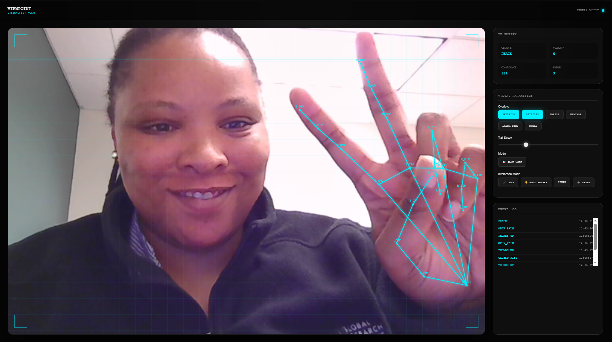

# VIEWPOINT — Movement Visualizer



A lightweight visual playground for gesture/mouse-driven effects: landmarks, trails, heatmap, laser lines, smoke particles, draggable shapes, and a simple target game.

## Quick Start

- Open with a local server (ES modules required):
  - PowerShell (Python):
    ```powershell
    python -m http.server 5500
    ```
    Then visit: http://127.0.0.1:5500/
  - Or use VS Code Live Server.
- Allow camera access to enable camera mode; otherwise click "FORCE MOUSE MODE".

## Features

- Landmarks overlay and detailed skeleton labels
- Motion trails with adjustable decay
- Heatmap accumulation and laser-eye lines
- Smoke particle effects
- Drawing mode and draggable, colorful shapes
- Simple target game with score tracking

## Structure

```
index.html
js/
  gesture.js
script.js
screen_shot.PNG
```

## Notes

- `index.html` loads `script.js` as a module and dynamically imports `js/gesture.js`.
- If the camera is unavailable or blocked, the app falls back to mouse input.
